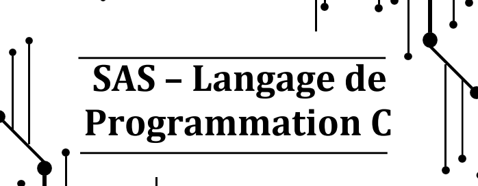

# 👨‍💻 YouCode - C Programming Bootcamp

Welcome to my repository for the **C Programming Bootcamp** at **YouCode School**!  
Here I will share my exercises, projects, and progress as I learn the fundamentals of the **C language**.

---

## 📷 Bootcamp Banner




---

## 📂 Repository Structure

```bash
📦 my-c-bootcamp
 ┣ 📂 day01
 ┣ 📂 day02
 ┣ 📂 day03
 ┣ 📂 day04
 ┣ 📂 projet1
 ┣ 📜 README.md
 ┗ 📜 LICENSE
